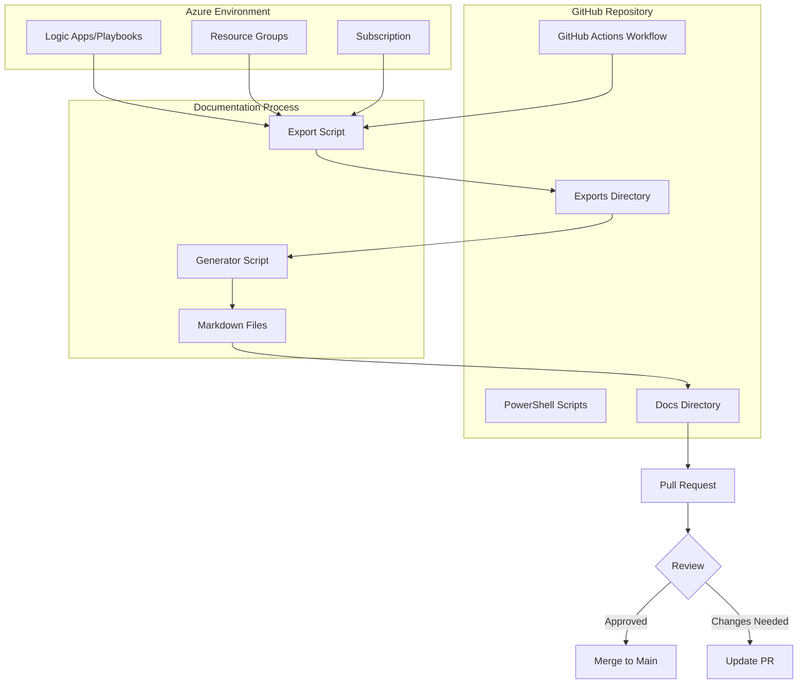
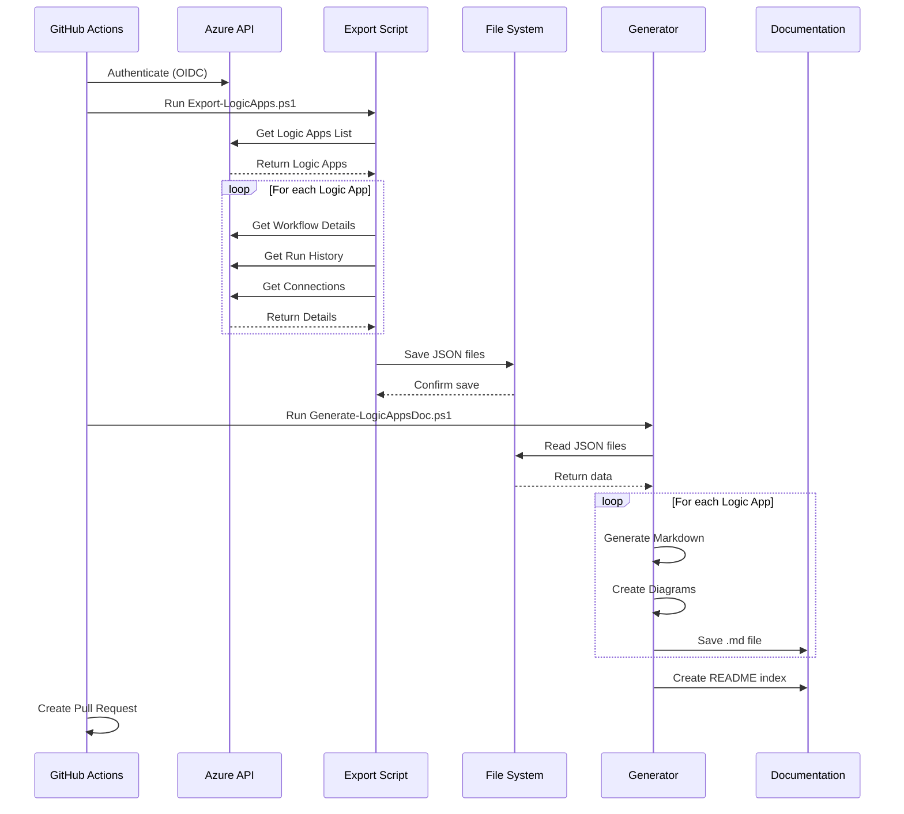
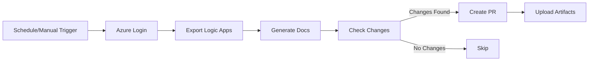
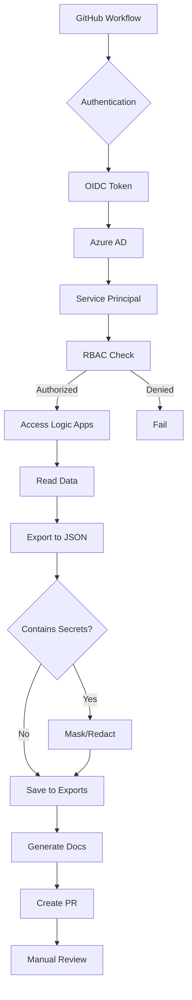
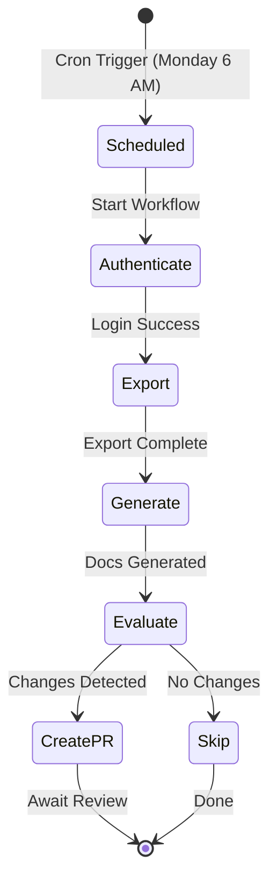
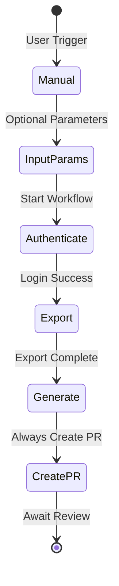
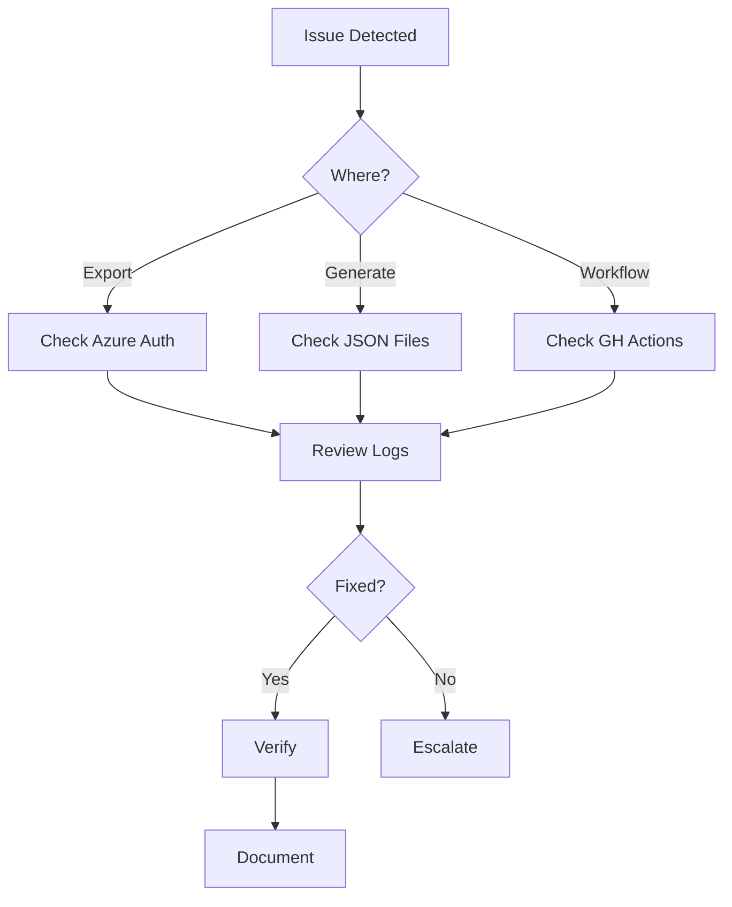

# Logic Apps Documentation - Architecture

This document explains the architecture and workflow of the automated Logic Apps documentation system.

## 🏗️ System Architecture



## 📊 Data Flow



## 🔄 Workflow Components

### 1. GitHub Actions Workflow
**File:** `.github/workflows/logicapps-document.yml`



**Features:**
- Scheduled execution (cron)
- Manual trigger with parameters
- Retry logic for Azure authentication
- Automatic PR creation
- Artifact upload for review

### 2. Export Script
**File:** `scripts/Export-LogicApps.ps1`

**Responsibilities:**
- Connect to Azure subscription
- Enumerate Logic Apps in scope
- Extract workflow definitions
- Retrieve run history statistics
- Identify connections and dependencies
- Export to JSON format

**Output:** JSON files in `exports/logicapps/`

### 3. Generator Script
**File:** `scripts/Generate-LogicAppsDoc.ps1`

**Responsibilities:**
- Read exported JSON files
- Generate markdown documentation
- Create Mermaid workflow diagrams
- Build inventory/index page
- Format metrics and statistics

**Output:** Markdown files in `docs/logicapps/`

### 4. Helper Functions
**File:** `scripts/Helpers.ps1`

**Provides:**
- Logging utilities (colored output)
- Mermaid diagram generation
- Markdown formatting helpers
- Badge generation
- Data transformation functions

## 📁 Directory Structure

```
test/
├── .github/
│   └── workflows/
│       ├── logicapps-document.yml          # Documentation workflow
│       └── sentinel-deploy-*.yml           # Deployment workflow
│
├── scripts/
│   ├── Export-LogicApps.ps1               # Azure export logic
│   ├── Generate-LogicAppsDoc.ps1          # Documentation generator
│   ├── Deploy-Sentinel.ps1                # Deployment script
│   └── Helpers.ps1                        # Shared utilities
│
├── docs/
│   ├── logicapps/                         # Generated documentation
│   │   ├── README.md                      # Auto-generated index
│   │   └── *.md                           # Individual Logic App docs
│   ├── diagrams/                          # Custom diagrams (if needed)
│   ├── SETUP_GUIDE.md                     # Setup instructions
│   └── QUICK_REFERENCE.md                 # Quick commands
│
├── playbooks/                             # Logic Apps ARM templates
│   └── example-playbook.json              # Example template
│
├── exports/                               # Export data (gitignored)
│   └── logicapps/
│       ├── *.json                         # Individual Logic App exports
│       └── summary.json                   # Export summary
│
├── .gitignore                             # Git ignore rules
├── sentinel-deployment.config             # Deployment configuration
└── README.md                              # Main documentation
```

## 🔐 Security Architecture



**Security Layers:**
1. **OIDC Authentication**: Passwordless authentication to Azure
2. **RBAC**: Least privilege (Reader role)
3. **Secrets Management**: GitHub Secrets for credentials
4. **Gitignore**: Prevent committing sensitive exports
5. **PR Review**: Human review before merging
6. **Branch Protection**: Require approvals

## 🎯 Execution Flow

### Scheduled Execution



### Manual Execution



## 📈 Scalability Considerations

### Current Design
- Handles **any number** of Logic Apps
- Processes **one subscription** at a time
- Supports **resource group filtering**

### Performance Optimization
1. **Parallel Processing**: Could be added for multiple resource groups
2. **Incremental Updates**: Only process changed Logic Apps
3. **Caching**: Cache Azure API responses
4. **Batching**: Process in batches if many Logic Apps exist

### Limitations
- GitHub Actions 6-hour execution limit
- Azure API rate limits
- Large workflows may generate large documentation

## 🔧 Extension Points

### Adding New Features

1. **Email Notifications**
   - Add email action in workflow
   - Send summary on completion

2. **Slack Integration**
   - Post updates to Slack channel
   - Include links to PRs

3. **Custom Metrics**
   - Add cost analysis
   - Include execution duration trends
   - Analyze failure patterns

4. **Multi-Tenant Support**
   - Loop through multiple subscriptions
   - Aggregate documentation
   - Compare across environments

5. **Change Tracking**
   - Git diff analysis
   - Highlight changes in PRs
   - Version comparison

## 🔄 Maintenance & Operations

### Regular Maintenance
- Review and approve PRs weekly
- Monitor workflow execution logs
- Check for failed runs
- Update service principal credentials (rotate)
- Review and archive old documentation

### Monitoring
- GitHub Actions execution history
- PR creation success rate
- Documentation coverage (% of Logic Apps documented)
- Export/generation duration trends

### Troubleshooting Workflow


## 📚 Related Documentation

- [Setup Guide](./SETUP_GUIDE.md) - Installation and configuration
- [Quick Reference](./QUICK_REFERENCE.md) - Common commands
- [Main README](../README.md) - Project overview

---

*Architecture Documentation - Version 1.0*  
*Last Updated: 2025-10-22*
